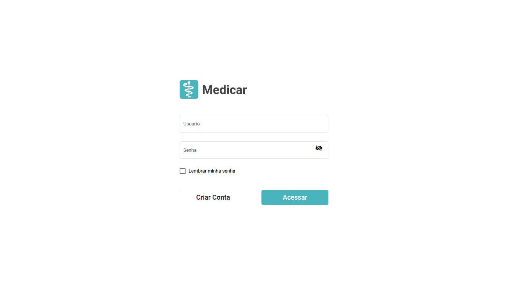
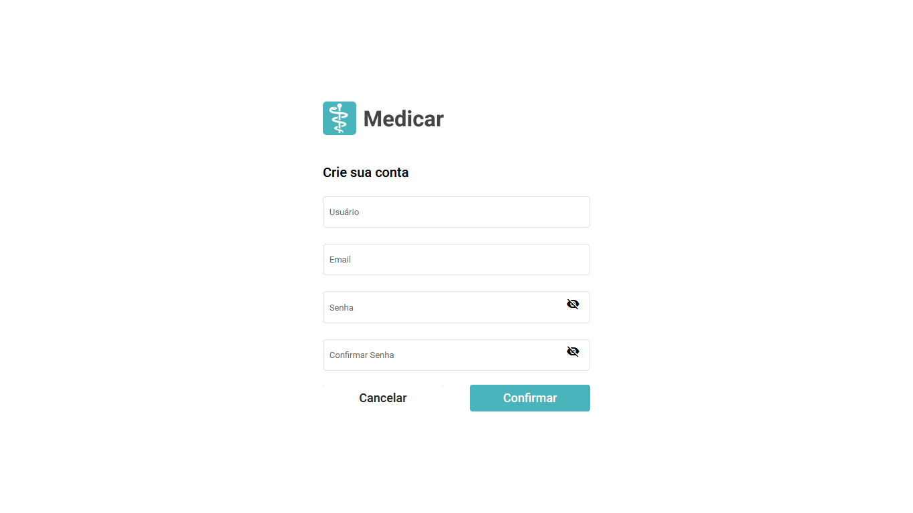
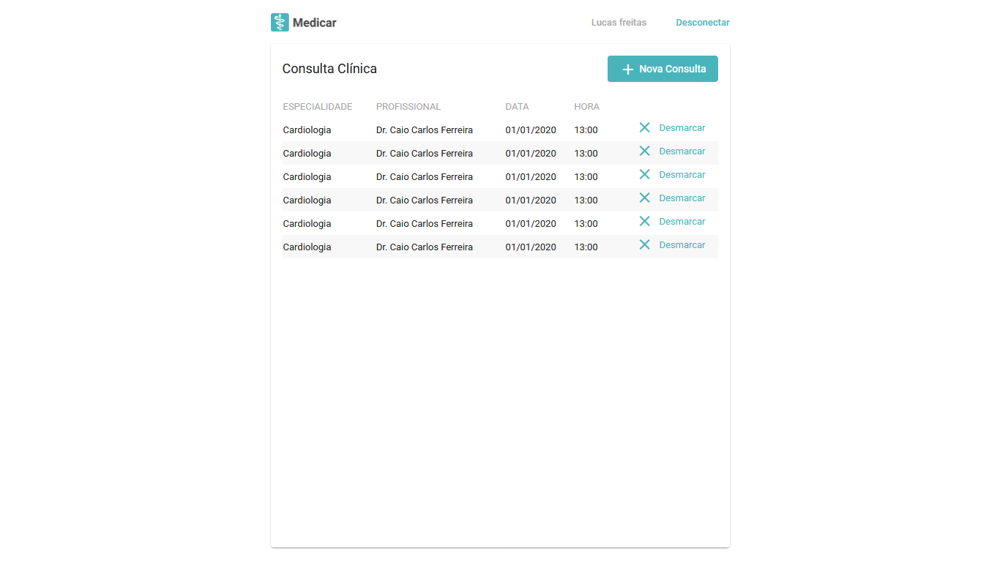
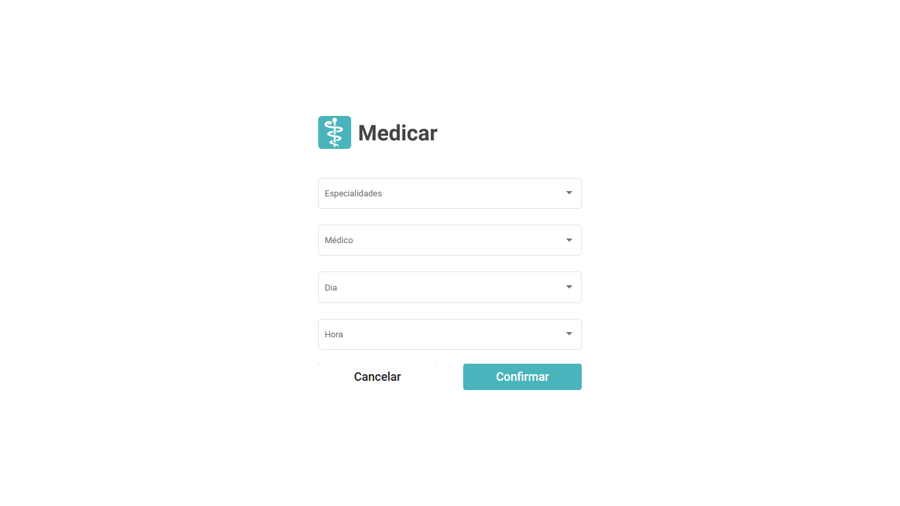

# MedicarFront

## Como rodar

1. Instalar NodeJS (https://nodejs.org/en/).
2. Instalar Angular CLI `npm install -g @angular/cli`.
3. Com o terminal aberto no diretório do projeto, instalar as dependencias com `npm install`.
4. Rodar o projeto com `ng serve -o`.
5. E possível navegar pelas telas, incluir e deletar uma consulta placeholder, app não está integrado ao backend.

## Sobre o projeto

Aplicativo de marcação de consultas Medicar desenvolvido com [Angular CLI](https://github.com/angular/angular-cli) version 11.0.7 para Desafio Intmed.  
UI foi montada usando Angular Material.

### Telas
1. Login  

2. Cadastrar
  
  
  
4. Listagem de consultas

5. Marcar nova consulta

